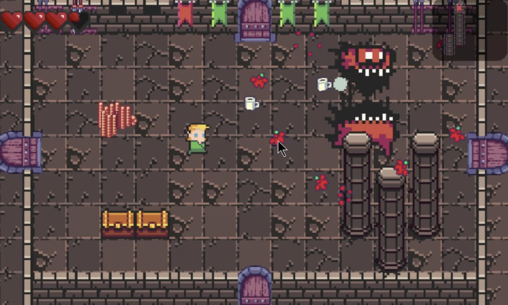

# Boom Boom Shoot

A shooting game like a simplified version of [The Binding of Isaac](https://store.steampowered.com/app/113200/The_Binding_of_Isaac/).

There are multiple rooms. In one room there are multiple enemies, obstacles, and tools. You can shoot to attack the enemies and objects. The goal is to kill all the bosses.

It is a C++ programming exercise as it is written from scratch using OpenGL and there is no advanced data structure involved.

The librararies yssimplesound, yspng, ysglfontdata, and fssimplewindow are from Dr. Soji Yamakawa at http://ysflight.in.coocan.jp/.

<p align="center">
    <a href="https://youtu.be/nkPYfIaBrvw">
    
    </a>
</p>

# Instructions for the Game
'esc':   exit

'w':     up

's':     down

'a':     left

'd':     right

'up':    shoot up

'down':  shoot down

'left':  shoot left

'right': shoot right

You can use mouse to shoot too.

# Build and Run the Project
## In MAC OS
If you have CMake,
```bash
mkdir build
cp -r data build
cd build
cmake ..
make
mkdir -p game.app/Contents/MacOS
mv game_main game.app/Contents/MacOS/exe
./game.app/Contents/MacOS/exe
```

If you do not have CMake, you can also do
``` bash
mkdir build
cp -r data build/data
cp -r include/ build
cp -r src/ build
cp fssimplewindow/macosx/* build
cp yspng/* build
cp yssimplesound/yssimplesound.cpp build
cp yssimplesound/yssimplesound.h build
cp yssimplesound/macosx/* build
cd build
clang -c fssimplewindowobjc.m
clang -c yssimplesound_macosx_objc.m
mkdir -p game.app/Contents/MacOS
g++ -std=c++11 MyDraw.cpp yssimplesound.cpp yssimplesound_macosx_cpp.cpp yssimplesound_macosx_objc.o fssimplewindowcpp.cpp fssimplewindowobjc.o yspng.cpp GameBar.cpp Menu.cpp Room.cpp Tool.cpp Rect.cpp Circle.cpp PngManager.cpp GameObject.cpp ActiveObject.cpp Player.cpp Computer.cpp Bullet.cpp Game.cpp game_main.cpp -framework Cocoa -framework OpenGL -o game.app/Contents/MacOS/exe
./game.app/Contents/MacOS/exe
```

## In Linux
You can build in linux as follows, but the sound might not show up.
```bash
mkdir build
cp -r data build
cd build
cmake ..
make
./game_main
```

If you don't have ALSA library, use the following command.
```bash
sudo apt-get install libasound2-dev
```

# Image and Audio Files Attribution
All the image and audio files used in this project are are copyright free under "Personal Use" or "Attribution 3.0".

In particular, our audio files are from
1. http://opengameart.org
2. Click-SoundBible.com-1387633738			http://soundbible.com/783-Click.html		Attribution 3.0
